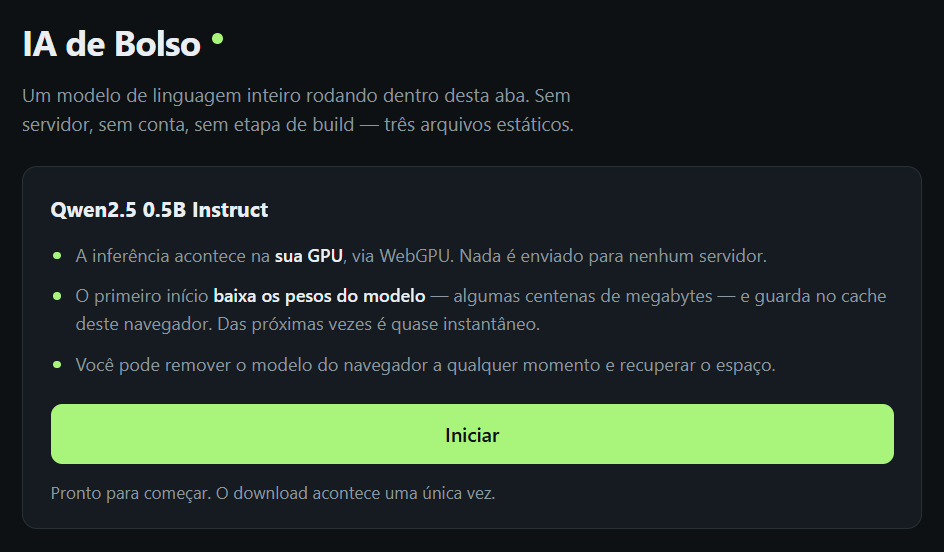
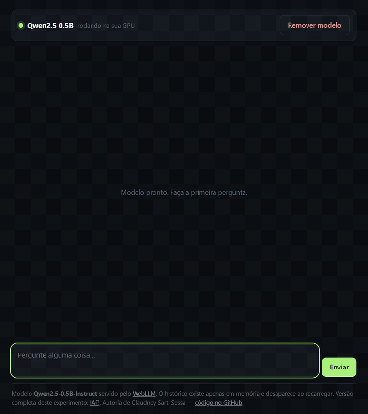

# IA de Bolso — Pocket Browser AI

**A complete language model running inside your browser tab. No server, no
account, no build step — three static files.**

🇧🇷 [Leia em português](./README.pt-BR.md)

[](https://claudneysessa.github.io/pocket-browser-ai/)
[](https://github.com/mlc-ai/web-llm)
[](./LICENSE)

**Live demo:** https://claudneysessa.github.io/pocket-browser-ai/



The app opens on a screen that says what is about to happen — the weights are
downloaded once, inference runs on your GPU, nothing leaves the device — and only
then offers **Iniciar**. Firing a several-hundred-megabyte download from an
unlabelled button would be hostile.

### Then the chat, with the model on your GPU



The animation is unedited output from the 0.5B model running locally. Nothing is
staged and no response was rewritten — including the parts where a model this
small shows its limits.

Removing the model returns to the opening screen and clears the conversation. No
model means no chat, so the two states stay honest about each other.

## What this is

The smallest honest example of local LLM inference on the web. Weights are
downloaded once into the browser cache, compiled to your GPU through WebGPU, and
every token is generated on your own machine. Nothing is sent anywhere.

It exists as the deliberate counterpart to
[**IAí?**](https://github.com/claudneysessa/in-browser-ai-chat), where I built
the full experience: Next.js, React, Tailwind, Drizzle, Cloudflare Workers,
persistent conversations, web research with source citation. That project answers
*"how far can this go?"*. This one answers a different and equally useful
question: **what is the irreducible minimum?**

The answer turned out to be `index.html`, `app.js`, `style.css`, and one import
statement. Same model, same parameters, ~150 lines of JavaScript, zero
installable dependencies.

## How it works

```
index.html   markup and states
app.js       ES module → imports WebLLM straight from a CDN
style.css    dark theme, single screen, no framework
```

There is no bundler because there is nothing to bundle. The browser resolves the
import natively:

```js
import { CreateMLCEngine } from "https://esm.run/@mlc-ai/web-llm@0.2.84";

const engine = await CreateMLCEngine("Qwen2.5-0.5B-Instruct-q4f16_1-MLC", {
  initProgressCallback: ({ progress, text }) => showProgress(progress, text),
});

const stream = await engine.chat.completions.create({
  messages,
  stream: true,
  temperature: 0.7,
  max_tokens: 320,
});
```

Four steps, in this order: check for WebGPU, download and compile the model,
stream the answer token by token, and let the user delete the weights again.

## Inference parameters

Identical to IAí?, so the two projects can be compared fairly.

| Setting | Value |
|---|---|
| Model | `Qwen2.5-0.5B-Instruct-q4f16_1-MLC` |
| Runtime | `@mlc-ai/web-llm` 0.2.84 (WebGPU) |
| Temperature | `0.7` |
| Max tokens | `320` |
| Streaming | enabled |
| System prompt | didactic assistant, answers in Brazilian Portuguese |

## Running locally

A static server is required — Chrome blocks ES modules loaded over `file://`, so
opening `index.html` by double-clicking will not work.

```bash
git clone https://github.com/claudneysessa/pocket-browser-ai.git
cd pocket-browser-ai
npx serve .          # or: python -m http.server 8000
```

Then open the address it prints and click **Carregar modelo**. The first load
downloads the weights; later loads read them from the browser cache.

## Requirements and limits

Stated plainly, because a demo that hides its constraints is not a demo:

- **WebGPU is mandatory.** Recent Chrome or Edge on desktop. Firefox and Safari
  support is still uneven, and the page says so instead of failing silently.
- **First load is a real download.** Several hundred megabytes of quantised
  weights. The progress bar reports actual bytes, not a fake animation.
- **0.5B parameters is a small model.** It is fluent and fast, not
  knowledgeable. It will get facts wrong. That is the honest trade-off of
  running entirely on a laptop GPU.
- **No persistence.** History lives in memory and clears on reload. That is a
  feature of the minimum, not an oversight — persistence is what IAí? is for.
- **The library comes from a CDN.** Pinned to an exact version. This adds no new
  class of dependency, since model weights are fetched from the network at first
  run either way.
- **No test suite or CI.** With no build to break and no domain logic to guard,
  a pipeline would be ceremony. Verification here is opening the page.

## Possible next steps

- Let the visitor pick between a few model sizes to feel the quality/latency
  curve.
- Move inference to a Web Worker so the UI stays responsive during generation.
- Measure and display real tokens-per-second per device.
- Publish a side-by-side comparison with IAí? about what the extra complexity
  actually buys.

## Credits

- [WebLLM / MLC AI](https://github.com/mlc-ai/web-llm) — the runtime that
  compiles and executes the model in the browser.
- [Qwen2.5-0.5B-Instruct](https://huggingface.co/Qwen/Qwen2.5-0.5B-Instruct) —
  model by the Qwen team at Alibaba Cloud, quantised by MLC AI.
- [Erick Wendel](https://github.com/ErickWendel) — his Web AI classes were the
  starting point for my exploration of this subject.

Application code, interface, and documentation by **Claudney Sarti Sessa**.
Model authorship and training are not mine — the contribution here is
engineering: making it run in the browser with the smallest possible surface.

## License

[MIT](./LICENSE)
